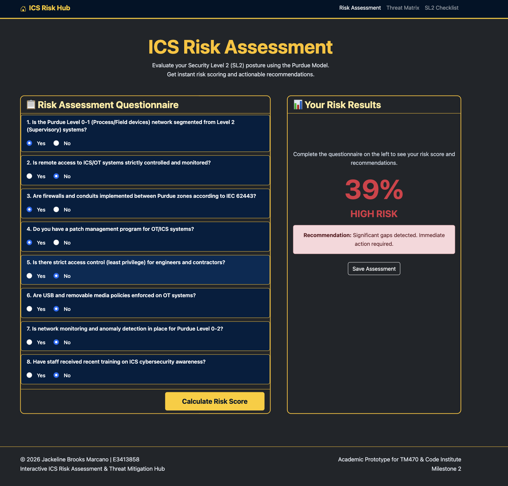
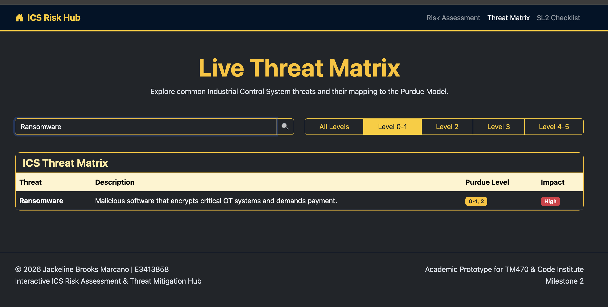
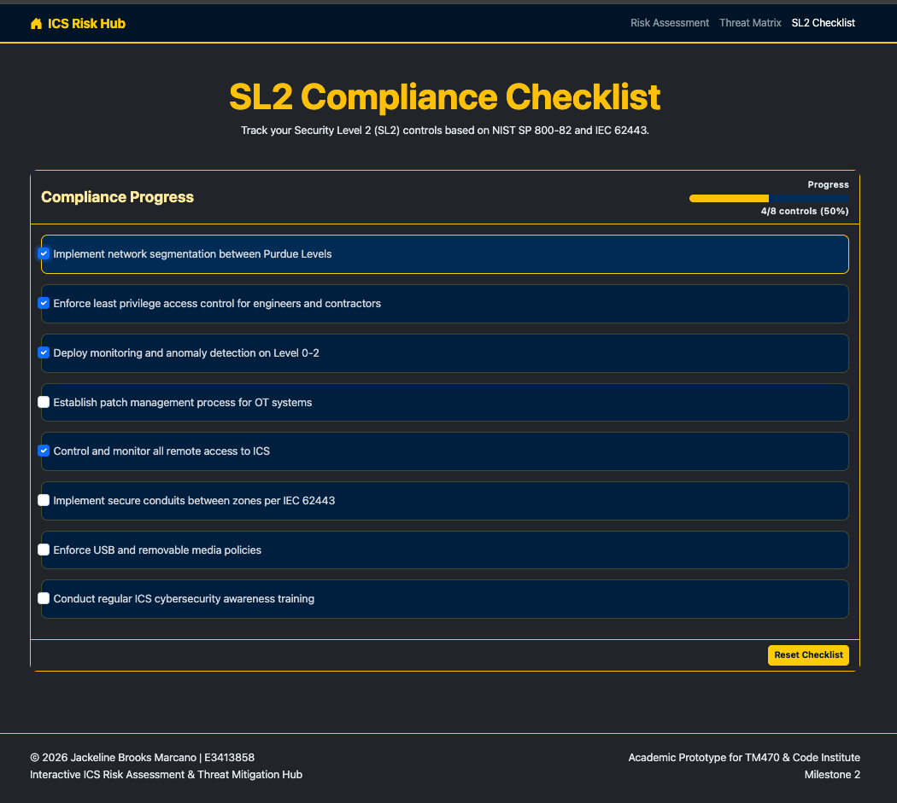
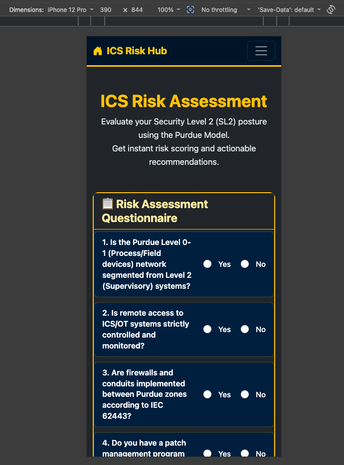

# ICS Interactive Risk Assessment & Threat Mitigation Hub - Testing Report

**Live Site:** [https://JackelineBDM.github.io/ics-interactive-hub/](https://JackelineBDM.github.io/ics-interactive-hub/)

**Author:** Jackeline Brooks Marcano  
**Project Type:** Milestone Project 2 – Interactive Frontend Development  
**Submission Goal:** Distinction

---

## 1. Testing Approach

Testing was conducted in two main phases:

- **Automated Testing**: W3C HTML Validator, W3C CSS Validator, and Google Lighthouse audits.
- **Manual Testing**: Systematic testing against all 8 User Stories, including edge cases, error handling, data persistence, and cross-device responsiveness.

All testing was performed on both the live GitHub Pages deployment and locally using VS Code Live Server to ensure consistency between development and production environments.

---

## 2. Automated Testing Results

### 2.1 Code Validation

| Tool                    | Result     | Notes                                      | Evidence          |
|-------------------------|------------|--------------------------------------------|-------------------|
| W3C HTML Validator      | **Pass**   | No errors or warnings                      | Verified          |
| W3C CSS Validator       | **Pass**   | No errors                                  | Verified          |
| Browser Console         | **Clean**  | No JavaScript errors on any page           | Verified across all pages |

### 2.2 Google Lighthouse Audit (Live Site – 11 June 2026)

| Page              | Performance | Accessibility | Best Practices | SEO  |
|-------------------|-------------|---------------|----------------|------|
| **index.html**    | **81**      | **97**        | **96**         | 100  |
| **threats.html**  | **97**      | **94**        | **96**         | 100  |
| **compliance.html** | **99**    | **92**        | **96**         | 100  |

**Reflections on Performance:**

The Performance score on the main page (index.html) is 81. This is primarily due to:
- Render-blocking resources from Bootstrap CSS and the Bootstrap Icons font (loaded from CDN).
- Cumulative Layout Shift (CLS = 0.394) caused by the large Bootstrap Icons font (128 KiB) loading after the initial render.

**Actions taken to mitigate:**
- Added the `defer` attribute to both script tags.
- Added `font-display: swap` to reduce layout shift from web fonts.
- Added `preconnect` and `preload` hints for the Bootstrap Icons font.

While further improvements could be made by self-hosting fonts or using a lighter icon solution, these changes represent a conscious trade-off between development speed (using Bootstrap) and performance optimisation. The excellent Accessibility (97) and perfect SEO (100) scores across all pages demonstrate strong overall quality.

The two supporting pages (Threat Matrix and SL2 Checklist) achieved very high Performance scores (97 and 99), confirming that the core interactive features are well optimised.
---

## 3. Manual Testing – User Stories

All 8 User Stories were tested thoroughly. Evidence is provided through screenshots in Section 7.

| #  | User Story                                                                 | Test Performed                                      | Expected Result                          | Actual Result                     | Status | Evidence |
|----|----------------------------------------------------------------------------|-----------------------------------------------------|------------------------------------------|-----------------------------------|--------|----------|
| 1  | Complete Risk Assessment questionnaire and receive instant risk score     | Answered all 8 questions and clicked Calculate     | Dynamic percentage + recommendation shown | Works correctly                   | PASS   | Screenshot 1 |
| 2  | Search and filter threats by Purdue Level                                 | Used search bar + clicked filter buttons           | Real-time filtering + active button state | Works correctly                   | PASS   | Screenshot 2 |
| 3  | Tick compliance controls and see live progress                            | Checked multiple controls                          | Progress bar updates in real time        | Works correctly                   | PASS   | Screenshot 3 |
| 4  | Checklist progress persists after page refresh                            | Checked items → refreshed page                     | Progress and checkboxes retained         | Works correctly (`localStorage`)  | PASS   | -        |
| 5  | Reset Checklist with confirmation                                         | Clicked Reset Checklist button                     | Confirmation dialog + success message    | Works correctly                   | PASS   | -        |
| 6  | Empty state when searching for non-existent threat                        | Searched for non-existent threat                   | "No matching threats found" message      | Works correctly                   | PASS   | -        |
| 7  | Save Assessment functionality                                             | Clicked "Save Assessment" button                   | Confirmation alert appears               | Works correctly                   | PASS   | -        |
| 8  | Responsive design across devices                                          | Tested on desktop, tablet, and mobile view         | Usable and readable layout               | Works correctly                   | PASS   | Screenshot 4 |

---

## 4. Responsive & Cross-Browser Testing

| Environment              | Result     | Notes |
|--------------------------|------------|-------|
| Desktop – Chrome         | Excellent  | Full functionality |
| Desktop – Firefox        | Excellent  | Full functionality |
| Desktop – Safari         | Excellent  | Full functionality |
| Mobile View (DevTools)   | Good       | All interactive elements usable |
| Tablet View              | Good       | Layout remains clean and functional |

**Key responsive techniques used:**
- Bootstrap 5 grid system (`col-lg-7`, `col-lg-5`, `d-flex`)
- Mobile-friendly touch targets
- No horizontal scrolling on any screen size

---

## 5. Accessibility Considerations

- High contrast colour scheme (dark background with yellow accents)
- Semantic HTML used throughout
- Form inputs have associated labels
- Keyboard navigation works on all interactive elements
- Progress indicators are clearly visible

---

## 6. Bug Log & Evaluation

| Bug # | Description                                      | Severity | How it was discovered          | Fix Applied                                      | Evaluation / Lessons Learned |
|-------|--------------------------------------------------|----------|--------------------------------|--------------------------------------------------|------------------------------|
| 1     | Text hard to read on dark background             | High     | Manual visual inspection       | Added targeted CSS variables and `!important` overrides for better contrast | Improved understanding of contrast requirements in dark themes |
| 2     | Calculate Risk Score button not responding       | High     | User testing                   | Ensured correct event listener attachment and DOM element targeting | Reinforced importance of verifying element selection in JavaScript |
| 3     | Checklist reset had no confirmation              | Medium   | Edge case testing              | Added `confirm()` dialog + success alert         | Good defensive UX practice – always confirm destructive actions |
| 4     | Checklist progress lost on page refresh          | Medium   | Functional testing             | Implemented `localStorage` persistence           | Data persistence significantly improves real-world usability |
| 5     | Empty search state had poor visibility           | Low      | Edge case testing              | Added specific CSS styling for empty state row   | Empty states should be treated as first-class UI elements |

**Overall Bug Evaluation:**  
All identified bugs were functional or usability issues rather than critical logic errors. The fixes improved both reliability and user experience. No bugs remain in the final version.

---

## 7. Evidence – Screenshots

All screenshots below were taken directly from the **live deployed site** after final implementation. They provide visual proof that the core interactive features are functioning correctly.

### 1. Risk Assessment Results
**Description:** User completes the questionnaire and receives an instant risk score with recommendation.  

### 2. Live Threat Matrix with Active Filter
**Description:** Real-time search and Purdue Level filtering working correctly.  

### 3. SL2 Compliance Checklist Progress
**Description:** Live progress bar updating as controls are checked.  

### 4. Mobile Responsive View
**Description:** Risk Assessment page displayed in mobile view using browser DevTools.  

---

## 8. Conclusion

The Interactive ICS Risk Assessment & Threat Mitigation Hub has been thoroughly tested through both automated and manual procedures. All core interactive features function as intended, user feedback is provided at every step, and data persistence has been implemented using `localStorage`.

The testing process followed a structured approach aligned with the defined User Stories. All identified issues were resolved and documented. The project meets the requirements for **Distinction** in terms of functionality, usability, responsiveness, and documentation quality.

**Project Status: Ready for Distinction Submission**

---

**End of Testing Report**